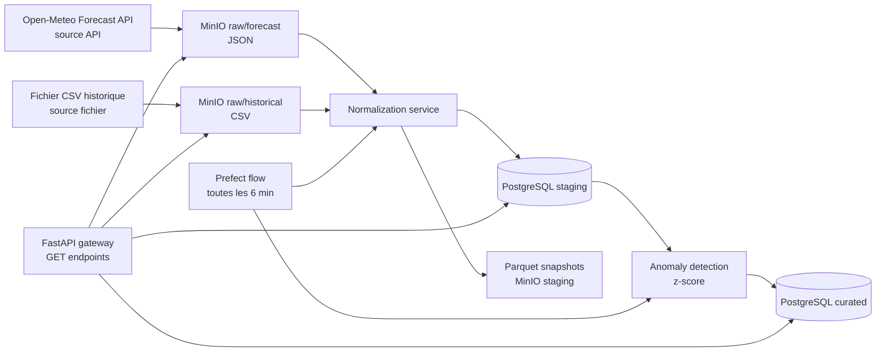

# Architecture

## Sources de données

| Source | Type | Format brut |
|--------|------|-------------|
| Open-Meteo Forecast API | **Appel API HTTP** | JSON |
| Fichier CSV historique | **Import fichier** | CSV |

## Zones de données

| Zone | Stockage | Contenu |
|------|----------|---------|
| Raw | MinIO (`raw-weather`) | JSON (forecast) + CSV (historical) bruts |
| Staging | PostgreSQL + Parquet | Données normalisées (température, humidité, vent, précipitations) |
| Curated | PostgreSQL | Z-scores et détection d'anomalies |

## Notes

- Raw est immutable et stocké tel quel.
- Staging stocke les enregistrements normalisés et les snapshots Parquet.
- Curated calcule le z-score par variable pour chaque point géographique (heure + mois).
- Un z-score > 2 signale une anomalie climatique.
